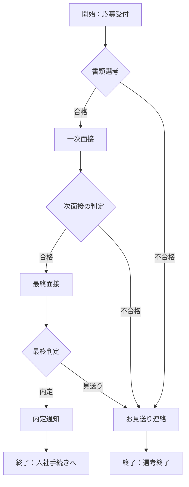

# /flowchart-decision-builder — 判断フロー図ビルダー

## 使い方
```
/flowchart-decision-builder 中途採用の選考プロセスを分岐込みで図にして
/flowchart-decision-builder 評価面談で異議申し立てがあった場合の対応フロー
/flowchart-decision-builder 有給申請の承認フロー（上長→人事の順）
/flowchart-decision-builder この文章の判断ステップをフローチャート化して：（文章を貼り付け）
```

## このスキルがやること
1. 元になる文章・箇条書き・会話内容から「作業ステップ」と「判断（分岐）ポイント」を分けて洗い出す
2. 判断ポイントごとに分岐先（YES/NO、承認/却下、条件A/条件Bなど）を明確にする
3. 開始点は1つに絞り、終了点は「終了：◯◯」と結果が分かる形にして、迷子にならない流れにする
4. Mermaid記法の `flowchart` コードとして出力する
5. 図の下に「日本語での流れの説明（読み上げ用の言葉）」を添える
6. 検証チェックリストを確認し、問題があれば図を修正してから完成とする

## 出力フォーマット
````markdown
# フローチャート：{タイトル（例：中途採用 選考フロー）}



## 流れの説明
1. 応募が来たら書類選考を行う
2. 書類選考で合格なら一次面接へ、不合格ならお見送り連絡をして終了
3. （以下、分岐ごとに平易な言葉で説明）

[図 - 要確認：Mermaid対応ツール（Notion、GitHub、mermaid.live等）に貼り付けて表示できます]
````

## 検証チェックリスト
- □ 開始点が1つに定まっているか（終了点は結果ごとに分かれてよいが、それぞれ「終了：◯◯」と何で終わるかを明記する）
- □ すべての判断（ひし形）に分岐が2つ以上あり、行き先が明記されているか
- □ 迷子になる矢印（どこにもつながらない・戻り先不明）がないか
- □ 分岐なしの単純な一本道になっていないか（それなら箇条書きで十分なので確認する）
- □ 人事担当者が読んでも専門用語なしで理解できる言葉になっているか
- □ Mermaidの構文エラーがないか（コードブロックとして正しく閉じているか）

## 終了条件
Mermaidコードと流れの説明を1セット提示したら、いったん完成として提示し「この内容で良いか、分岐の追加・修正はないか」を確認して止まる。

## フィードバック反映（自動ブラッシュアップ用）
- 実行前に `~/.claude/projects/C--Users-khiro/memory/feedback_skills.md` があれば読み、このスキルへの過去の修正指示を反映する
- ユーザーから出力への修正指示を受けたら、同ファイルに「日付／スキル名／指示内容／今後どうするか」を1行で追記し、同じ指摘を二度受けないようにする
